# KyesAstroPhotos
A collection of my images taken throughout my involvement in astrophotography.
 
Also includes NOAA satellite imagery I've decoded through my DIY RF antenna.

**Astrophotography**
 

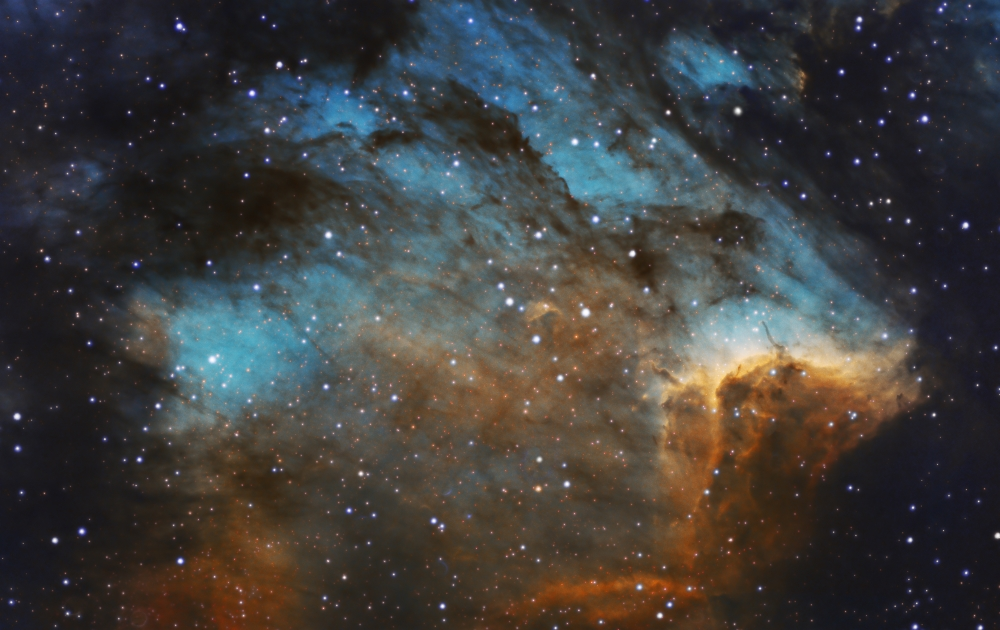
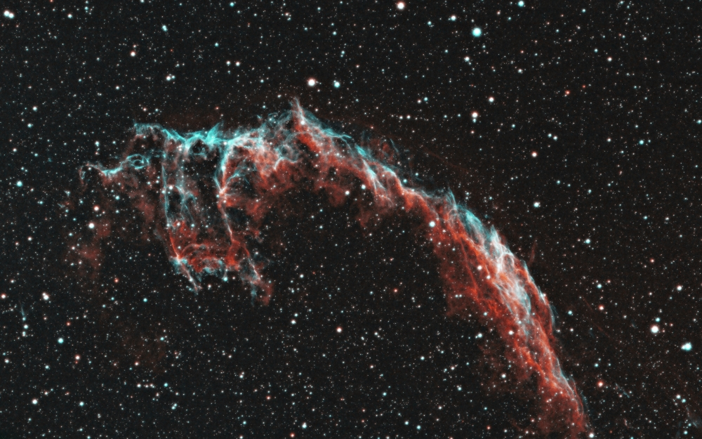
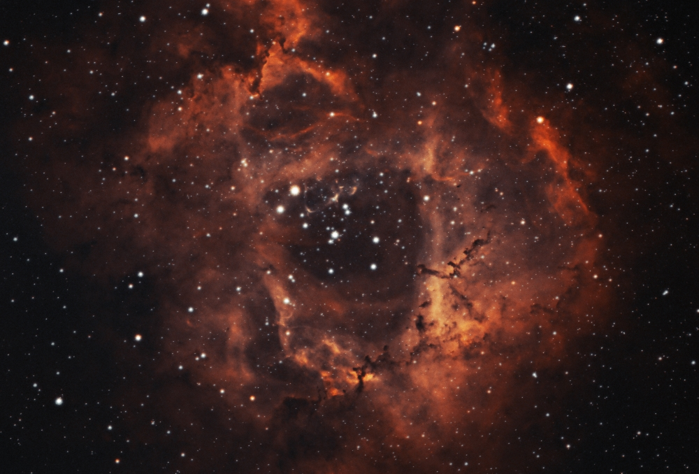
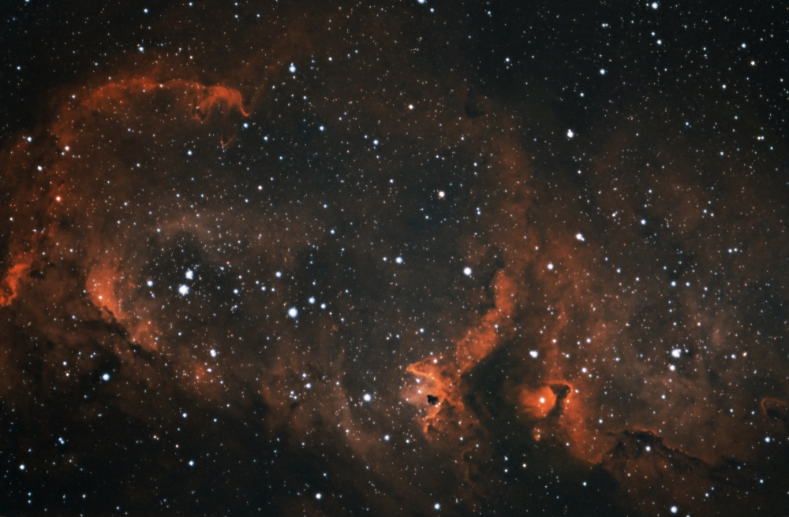
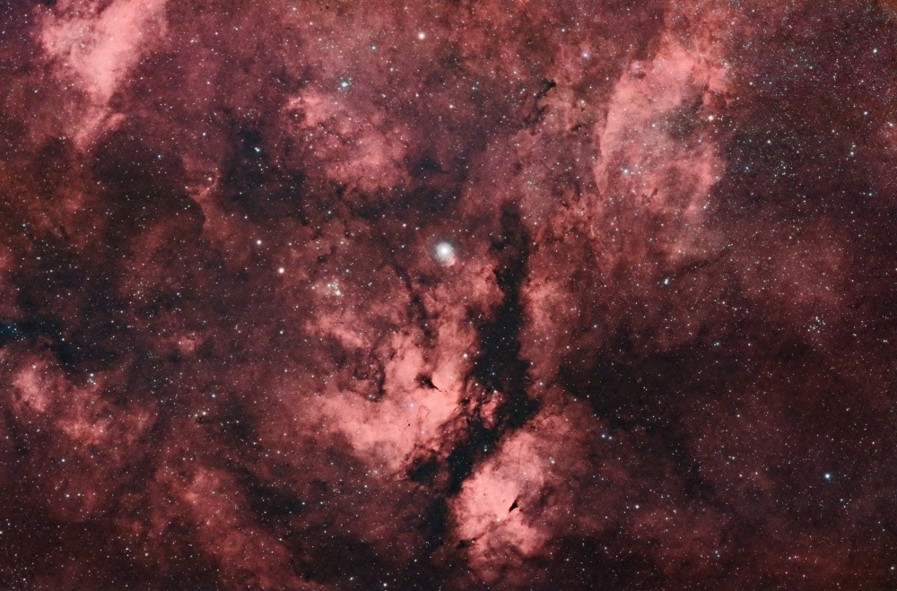
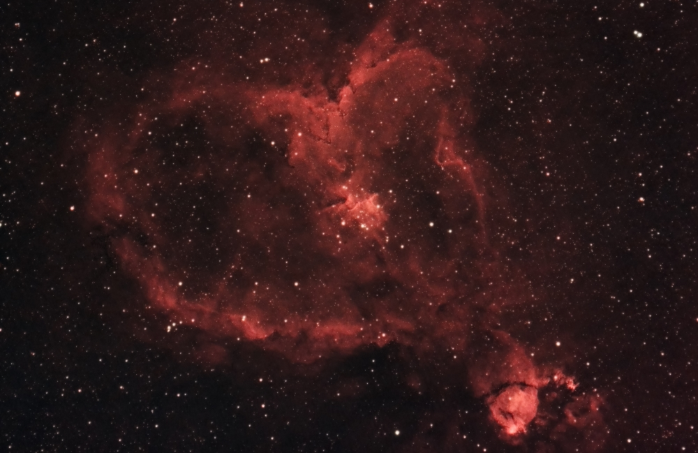
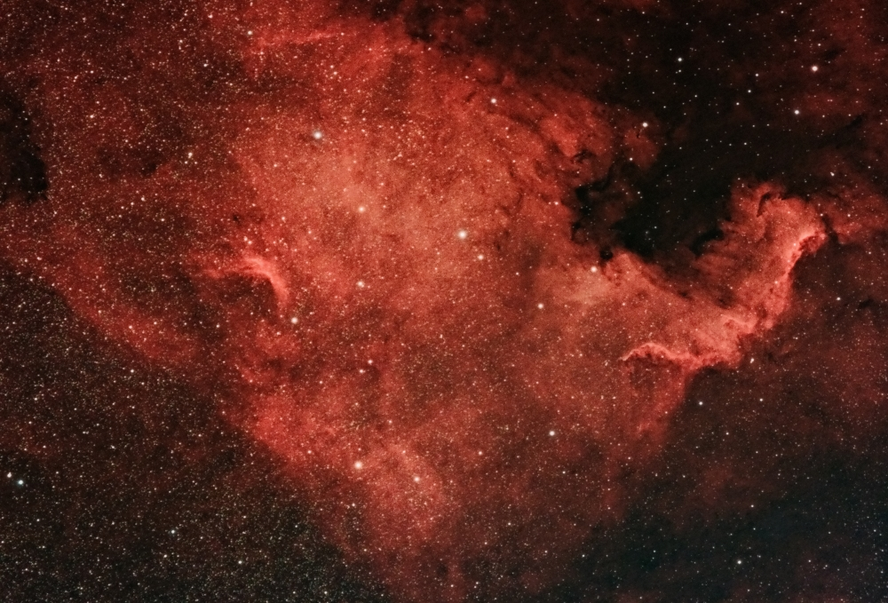
 
 

**NOAA**
 
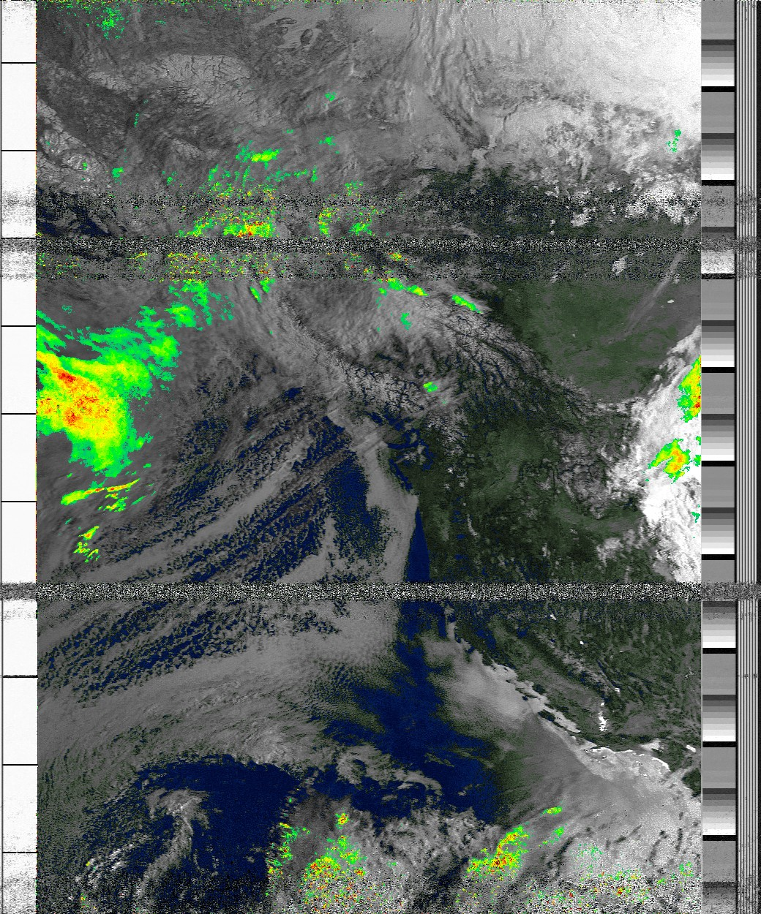
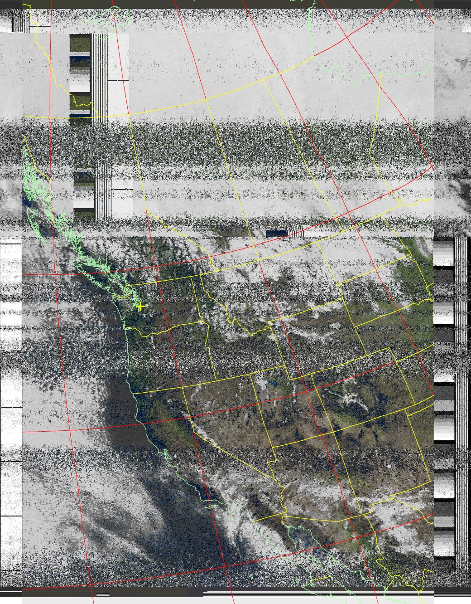
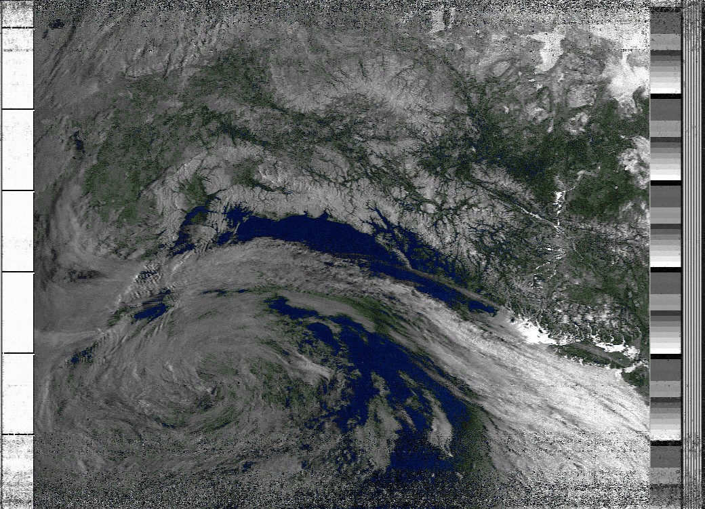
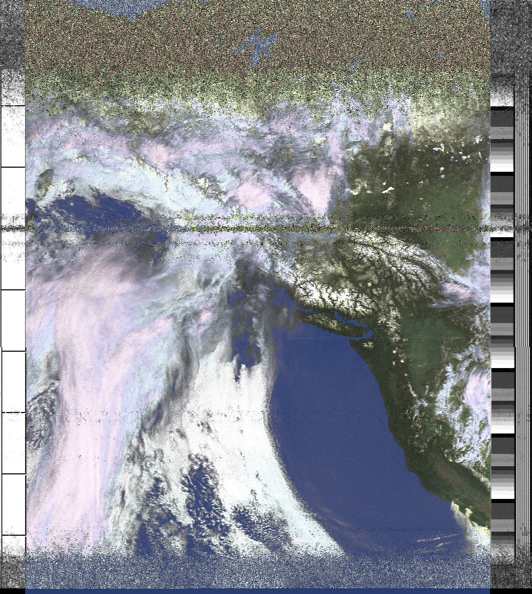
 

**Setup:**
  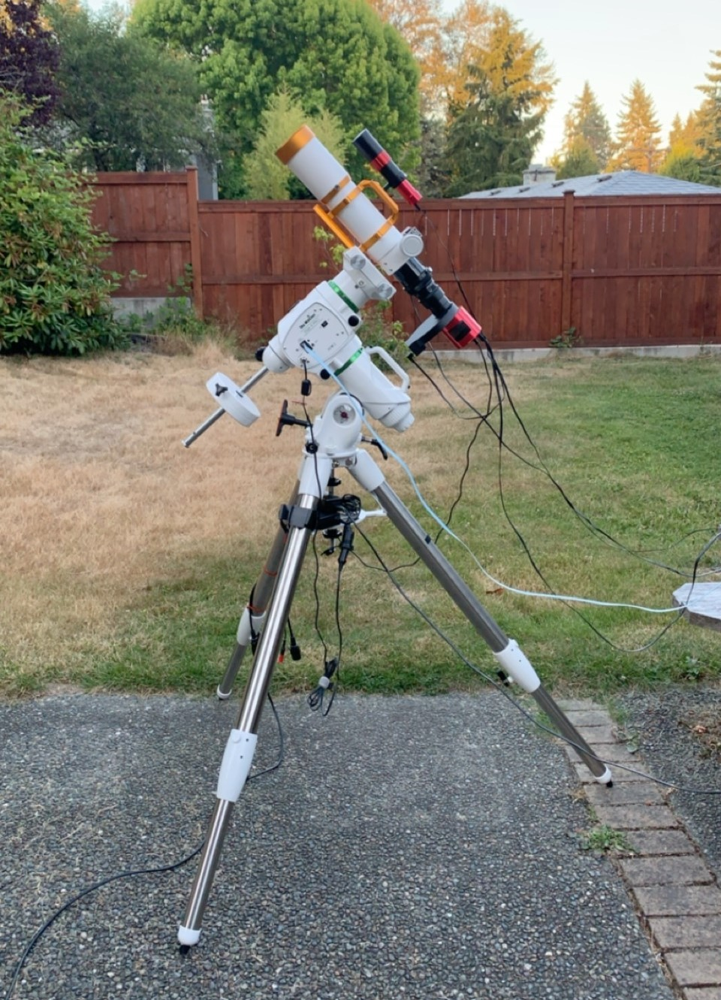

- **Scope:** William Optics Zenithstar 73
- **Camera:** ZWO ASI183MM Pro
- **Mount:** Sky-Watcher EQ6-R Pro
- **Autoguider:** ZWO 30mm Mini Guide + ZWO ASI120MM-mini
- **Autofocuser:** ZWO EAF
- **Filters:** ZWO LRGB filter set + Astronomik 6nm Ha + Oiii + Sii filters
